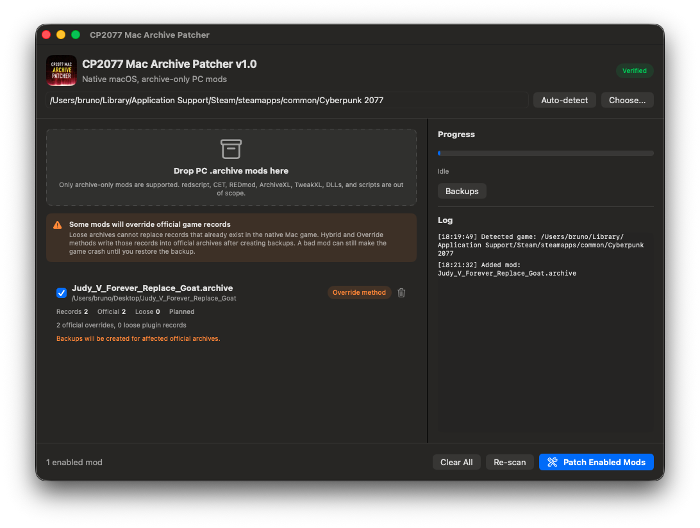

# CP2077 Mac Archive Patcher

Native macOS Cyberpunk 2077 archive-only mod patcher.



---

Cyberpunk 2077's native macOS release does not load PC archive mods the same way the Windows version does. Many mods that are just a `.archive` file are close to working, but the Mac build expects resources to live in its own `archive/Mac` layout, and loose archives cannot override records that already exist in official Mac archives.

CP2077 Mac Archive Patcher is a small native Mac app that bridges that gap. Drop in archive-only PC mods, let the app inspect what the mod changes, and it will choose the cleanest install method it can: a removable plugin archive when possible, or a backed-up official archive override when necessary.

This is intentionally focused on one job: archive-only mods for the native Apple Silicon version of Cyberpunk 2077. It does not try to support redscript, CET, REDmod, ArchiveXL, TweakXL, native plugins, scripts, or Windows DLLs.

## What It Does

The patcher makes many archive-only PC mods work on the native macOS version by translating them into the archive layout the Mac game actually loads.

It uses two install paths:

- **Plugin method**: installs new/missing resources as loose `basegame_99_*.archive` files under `archive/Mac`. These can be removed cleanly.
- **Hybrid / Override method**: when a resource already exists in the Mac game archives, the patcher backs up the official archive and replaces only the matching records.

Mods are installed into the game files, so they work regardless of whether the game is launched through Steam, Finder, or a custom script. Steam file verification or game updates may overwrite official archive patches.

## App Features

- auto-detects common Steam/GOG game install paths
- manual game folder picker
- drag/drop one or more `.archive` mods
- duplicate-file warnings
- per-mod method labels
- warning and confirmation flow before official archive overrides
- progress bar and patch log
- in-app backup manager with restore/delete actions
- full-file backups before official archive writes
- app bundle icon and double-clickable macOS app build

## Download

For normal users, download the packaged `.app` from GitHub Releases when available.

If macOS warns that the app is from an unidentified developer, right-click the app, choose **Open**, then confirm. If something is off, check whether macOS is asking for approval in **System Settings > Privacy & Security**.

## First Test

Start with a small visual replacer before trying a large multi-file mod stack. One known simple test candidate is [JudyV Arm Tattoo (Vanilla Only)](https://www.nexusmods.com/cyberpunk2077/mods/3132?tab=files&file_id=16507), which is a lightweight archive-only appearance mod.

For first-run testing:

1. Open the app.
2. Confirm the game path is detected.
3. Drop the downloaded `.archive` file into the window.
4. Review the method label and warnings.
5. Click **Patch Enabled Mods**.
6. Launch the game normally.

## Build From Source

Requirements:

- macOS 14 or newer
- Xcode command line tools
- Swift 6 toolchain

Build everything:

```sh
swift build
```

Build the double-clickable macOS app bundle:

```sh
scripts/build-app.sh
open ".build/release-app/CP2077 Mac Archive Patcher.app"
```

## CLI

The GUI is the recommended interface, but the repo also includes a CLI for testing and troubleshooting.

Scan one or more mod archives:

```sh
.build/debug/cp2077-patcher scan /path/to/mod.archive
```

Verify the Mac game archives:

```sh
.build/debug/cp2077-patcher verify \
  --game "/Users/me/Library/Application Support/Steam/steamapps/common/Cyberpunk 2077"
```

Patch mods with the default hybrid strategy:

```sh
.build/debug/cp2077-patcher patch \
  --game "/Users/me/Library/Application Support/Steam/steamapps/common/Cyberpunk 2077" \
  --mods /path/to/mod1.archive /path/to/mod2.archive
```

Aggressive fallback mode patches the whole source archive into one target archive. This mutates official game archives more heavily and should only be used when hybrid mode cannot support a mod:

```sh
.build/debug/cp2077-patcher patch \
  --game "/Users/me/Library/Application Support/Steam/steamapps/common/Cyberpunk 2077" \
  --strategy aggressive \
  --target "/Users/me/Library/Application Support/Steam/steamapps/common/Cyberpunk 2077/archive/Mac/content/basegame_4_appearance.archive" \
  --mods /path/to/mod.archive
```

Restore latest backup:

```sh
.build/debug/cp2077-patcher restore \
  --game "/Users/me/Library/Application Support/Steam/steamapps/common/Cyberpunk 2077" \
  --latest
```

Restore a specific backup:

```sh
.build/debug/cp2077-patcher restore \
  --game "/Users/me/Library/Application Support/Steam/steamapps/common/Cyberpunk 2077" \
  --backup "/path/to/Cyberpunk 2077/archive/Mac/_cp2077_mac_patcher/backups/backup-id"
```

## Safety Model

Backups are stored in:

```text
Cyberpunk 2077/archive/Mac/_cp2077_mac_patcher/backups/
```

Each official archive mutation creates a full backup first. This is intentionally disk-heavy because it keeps rollback simple and reliable.

Use the app's **Backups** screen to restore a game file or delete old backups.

## Known Limitations

- Archive-only mods can still fail if they depend on non-archive mod frameworks.
- Loose archives cannot override resources that already exist in official Mac archives.
- Some archives have compressed name tables, so diagnostics may only show resource hashes.
- If multiple mods touch the same resource, the last patched mod wins.
- Steam verification and game updates may remove official archive patches.
- Signed/notarized distribution is not implemented yet.
